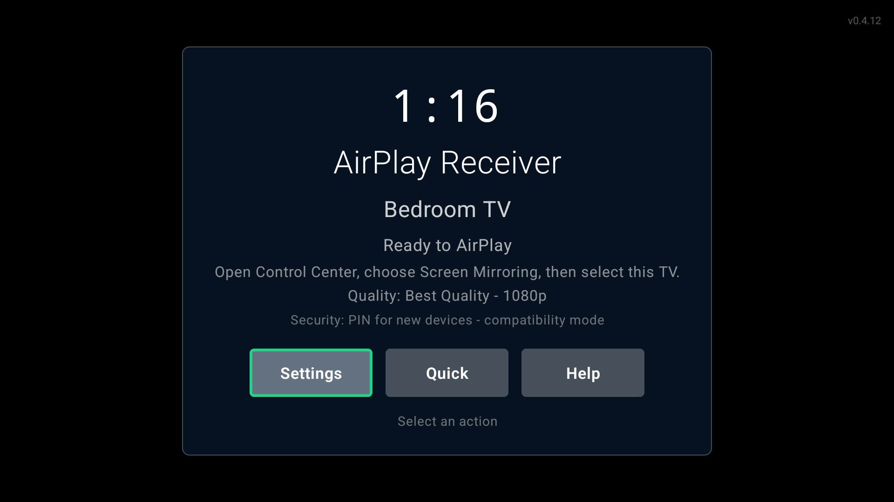
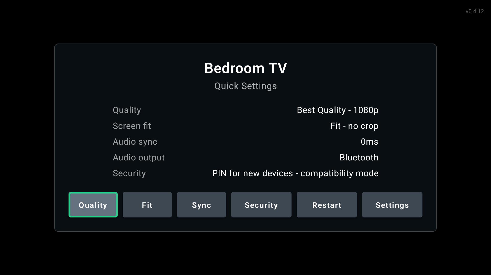
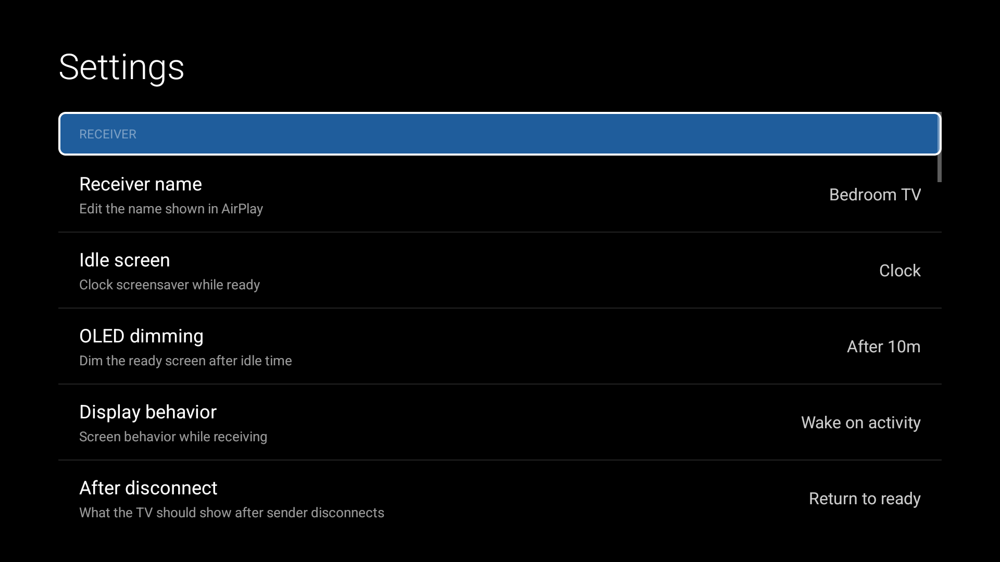
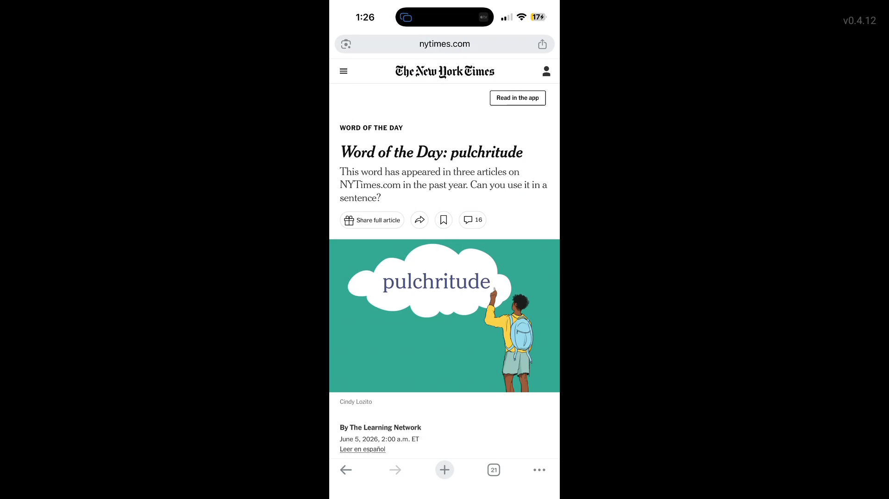

# 影屏（YingScreen）

影屏是面向 Zidoo/Android TV 的家庭局域网投屏接收器。安装并打开 APK 后，在 iPhone 或 iPad 的控制中心选择“屏幕镜像”，再选择“家庭影院”即可连接。项目不包含账号、广告、云服务或投屏时长限制。

本项目基于 `lekandigital/android-tv-airplay-receiver`，保留其 AirPlay/RAOP、FairPlay 兼容层、AAC/ALAC 和 H.264 原生实现，并按 GPLv3 继续开源。

## 第一版目标

- iPhone/iPad 屏幕镜像发现与连接
- H.264 视频硬件解码及 AAC/ALAC 音频播放
- 横竖屏适配、断线恢复和 Android TV 遥控器操作
- 默认接收器名称“家庭影院”
- 支持 `arm64-v8a`、`armeabi-v7a`，最低 Android 6.0（兼容 Zidoo X9S）

腾讯视频或其他 App 对 DRM 内容的限制由内容提供方和 iOS 决定；影屏不绕过内容 DRM。

The existing native RAOP, mirroring, FairPlay, AAC/ALAC, and H.264 stack is preserved. The Android layer wraps it with TV-native onboarding, discovery, ready-state UI, quick controls, diagnostics, audio-only playback, and release packaging.

## Screenshots

| Ready screen | Quick settings | Main settings |
| --- | --- | --- |
|  |  |  |

Screenshots were captured from a Chromecast with Google TV running the release APK.

## AirPlay In Action

| Portrait mirroring | Landscape mirroring |
| --- | --- |
|  |  |

The receiver adapts to the sender orientation and preserves the source aspect ratio instead of stretching phone content to fill the TV.

## Highlights

- Android TV / Google TV positioning with Leanback launcher support and landscape-only activities.
- D-pad ready screen with clock, receiver name, quick settings, full settings, and connection help.
- First-run setup for receiver name, security preference, quality profile, and connection instructions.
- H.264 mirroring to `SurfaceView` with startup buffering, SPS/PPS replay, frame-rate hints, and stall recovery.
- AirPlay audio playback through `AudioTrack`, including AAC/ALAC handling, metadata, cover art, MediaSession updates, and audio-only UI.
- Quick controls for quality, screen fit, audio sync, audio route, security mode, and discovery restart.
- Main settings for receiver behavior, room presets, security, appearance, display, audio, network help, accessibility, diagnostics, experimental features, and identity reset.
- Room presets for saving up to five named snapshots of receiver name, quality, screen fit, audio sync, audio-only display, security mode, wake behavior, and visualizer preference.
- Idle styles for Clock, Minimal, Art, Weather, and Photos, with burn-in-conscious dimming and pixel-shift behavior. Weather uses Open-Meteo with manually configured coordinates and cached summaries.
- Visual themes for Midnight, Warm, and Light. Light mode is available for bright rooms and warns about OLED burn-in risk.
- Optional background discovery keeps DNS-SD advertisements alive when the UI is not foregrounded, with a low-battery guard for portable Android TV devices.
- Optional experimental HDMI-CEC wake tries Android TV HDMI control first and falls back to a wake lock. Hardware support varies by TV and input chain.
- Optional experimental PINN adaptive streaming runs a tiny on-device Kotlin neural network to forecast buffer and thermal pressure, then applies conservative profile hints without exceeding the user-selected baseline.
- Privacy-conscious session history stores recent local connection/performance diagnostics with hashed sender identifiers, optional hidden names, and a 100-session cap.
- Diagnostics with state history, network/discovery status, feature states, session history summaries, session stats, suggestions, clipboard copy, and file export.
- Release posture for Play TV: targetSdk 34, App Bundle output, 64-bit native libraries, and 16 KB page-size linker alignment.

## Using It

1. Install and open the app on an Android TV or Google TV device.
2. Choose a receiver name and starting quality profile during first-run setup.
3. Keep the app on the ready screen.
4. On iPhone or iPad, open Control Center, choose Screen Mirroring, and select the TV name.
5. On Mac, use Control Center or Displays, then choose the TV name.

The receiver returns to the ready screen after disconnect by default and remains discoverable while the foreground service is running.

Background discovery is off by default. Enable it in Settings > Network when the TV should remain visible to AirPlay senders after the app UI is closed.

## Runtime Controls

The ready screen intentionally hides IP addresses, receiver IDs, and sender history. It shows only the clock, receiver name, status, connection hint, quality profile, and security mode.

Use the remote:

- Select on `Settings` opens the full settings screen.
- Select on `Quick` opens the quick settings overlay.
- Select on `Help` opens connection instructions.
- Select during video playback opens the playback overlay.
- Back hides the current overlay or returns from playback to ready.
- Remote volume keys control Android media volume.

The playback overlay includes Stop, Screen Fit, Audio Sync, Settings, Diagnostics, and Traffic actions.

If room presets exist, Quick Settings also exposes a Preset action that cycles through the saved presets and refreshes discovery immediately.

## Quality Profiles

- Auto: choose a practical display size from the TV capabilities.
- Low Latency: 720p with conservative latency.
- Balanced: 1080p with moderate buffering.
- Best Quality: 1080p for the cleanest source stream.
- Compatibility: 720p for older or problematic senders.
- Audio Stable: 720p with audio-focused buffering.

Frame-rate matching uses `Surface.setFrameRate()` on API 30+ when enabled, with 60 fps as the fallback when sender cadence cannot be detected.

## Appearance And Idle Screen

Settings > Appearance provides Midnight, Warm, and Light visual themes. The Compose TV overlays update immediately; legacy Android list screens keep the platform dark styling.

Settings > Receiver > Idle screen style provides:

- Clock: the default ready screen with a pixel-shifted clock.
- Minimal: a low-brightness ready indicator for the lowest burn-in risk.
- Art: bundled dark gradient drawable resources with subtle overlay text.
- Weather: cached Open-Meteo summaries when a location and coordinates are configured.
- Photos: a local-directory preference for user-provided photos; when unset, the app falls back to the art presentation.

Weather mode does not use a cloud key and does not upload telemetry. It fetches directly from Open-Meteo and caches the last summary so the idle screen has a fallback when the network is unavailable.

## Room Presets

Room presets store user-facing settings only. They do not include trusted or blocked device lists, receiver identity, experimental flags, or diagnostics settings.

Use Settings > Room Presets to save, load, and delete presets. Loading a preset applies the settings immediately and refreshes AirPlay/RAOP discovery because the receiver name may change. Up to five presets are kept.

## Security Modes

The UI exposes four security preferences:

- PIN for new devices.
- PIN every session.
- Trusted devices only.
- Open - no pairing required.

Important: current discovery remains on the compatible `pw=false` AirPlay path. The PIN screen is a compatibility placeholder, and native Apple PIN verification is not cryptographically enforced yet. The existing native gate can reject blocked, untrusted, or takeover senders where a sender identifier is available, but true AirPlay PIN enforcement still requires a native password-authenticated pairing implementation.

Session history is stored locally in SQLite when enabled. Sender identifiers are hashed before storage, sender display names can be hidden, and only connection/performance metadata is recorded. Playback content is never logged.

## Experimental Features

HDMI-CEC wake is off by default under Settings > Experimental. When enabled, incoming AirPlay activity tries Android TV HDMI one-touch-play through reflection because some SDKs expose HDMI control only as a device API. If HDMI control is unavailable or fails, the app acquires a short wake lock instead. Either way, wake failure never rejects the AirPlay connection.

Adaptive streaming (PINN) is also off by default under Settings > Experimental. It uses a pure Kotlin 16-32-16-6 feedforward model with 1,174 float weights, sampled every 500 ms from local throughput, latency, queue-size, frame-rate, loss, thermal-proxy, elapsed-time, and quality-profile features. The model observes for the first 60 seconds of a session, trains on-device every 30 seconds, persists its small binary weight file in internal storage, and can be reset from Settings.

The PINN is deliberately advisory. A deterministic controller interprets predictions, requires consecutive votes before acting, never upgrades beyond the user’s baseline quality profile, and exposes a short playback-overlay notice when it auto-adjusts. On current AirPlay protocol paths, some quality changes are best-effort hints for future decoder setup rather than guaranteed sender-side renegotiation.

## Known Limits

- DRM-protected or app-restricted streams may not play.
- Some sender OS/app combinations may negotiate protocol features this receiver does not implement.
- Guest Wi-Fi, VPNs, multicast filtering, and client isolation can prevent discovery.
- Metadata and album art depend on the sender forwarding AirPlay/DMAP metadata.
- Route-specific audio sync is still future work because Android TV audio-route identity is inconsistent across devices.

## Build

Use Java 17 with the Android SDK installed:

```bash
JAVA_HOME="/opt/homebrew/opt/openjdk@17/libexec/openjdk.jdk/Contents/Home" \
ANDROID_HOME="$HOME/Library/Android/sdk" \
./gradlew --no-daemon test assembleRelease bundleRelease
```

Outputs:

- APK: `app/build/outputs/apk/release/app-release.apk`
- AAB: `app/build/outputs/bundle/release/app-release.aab`

Release signing reads `signing.properties` when present and falls back to debug signing for local ad hoc builds. Do not commit keystores or signing secrets.

## Release Posture

- Minimum SDK: Android 8.1 / API 27.
- Target SDK: API 34.
- ABIs: `arm64-v8a`, `armeabi-v7a`.
- Leanback required: yes.
- Touchscreen required: no.
- Native shared libraries use `-Wl,-z,max-page-size=16384`.
- Android App Bundle split output is enabled for Play release builds.

## Project Layout

- `app/src/main/kotlin/io/carmo/airplay/receiver/`: Kotlin app, runtime, UI, settings, diagnostics.
- `app/src/main/java/com/apple/dnssd/`: legacy Java DNS-SD compatibility bindings.
- `app/src/main/cpp/`: native AirPlay, RAOP, mirroring, codec, crypto, and JNI code.
- `docs/architecture.md`: runtime architecture and data flow.
- `docs/performance.md`: Android TV performance assumptions and tuning notes.
- `docs/vendor-audit.md`: retained vendored code and license notes.

## License

AirPlay Receiver is distributed under GPLv3 because the retained native Playfair component is GPLv3. Third-party code keeps its original notices in the vendored source directories; see `docs/vendor-audit.md`.

## App Identity

- App name: `AirPlay Receiver`
- Android application id: `io.carmo.airplay.receiver`
- Minimum Android version: Android 8.1 / API 27
- Target Android version: API 34
